# CodeDuel — Architecture Documentation

> **Audience:** Software engineers, system designers, and technical interviewers evaluating this codebase.
>
> **Scope:** Current production architecture as implemented in the `contest-platform` monorepo.

---

## Table of Contents

1. [System Overview](#1-system-overview)
2. [Monorepo Structure](#2-monorepo-structure)
3. [Frontend Architecture](#3-frontend-architecture)
4. [Backend Architecture](#4-backend-architecture)
5. [API Architecture](#5-api-architecture)
6. [Real-Time Communication](#6-real-time-communication)
7. [Queue & Worker Architecture](#7-queue--worker-architecture)
8. [Judge & Execution Pipeline](#8-judge--execution-pipeline)
9. [Lifecycle Diagrams](#9-lifecycle-diagrams)
10. [Security Architecture](#10-security-architecture)
11. [Architectural Decisions & Tradeoffs](#11-architectural-decisions--tradeoffs)

---

## 1. System Overview

CodeDuel is a **distributed competitive programming platform** composed of four npm workspace packages orchestrated by a root `package.json`. The system follows a classic **API gateway + async worker** pattern with **Redis** as the coordination backbone for both job queues and real-time pub/sub.

### Complete system architecture

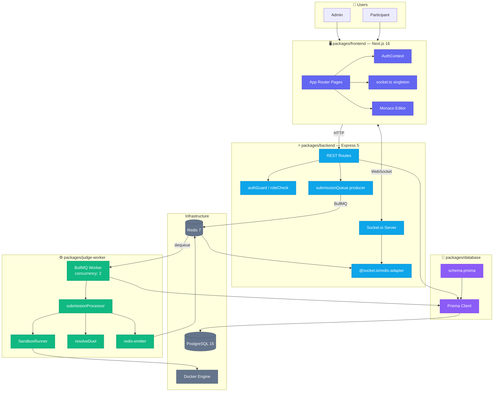

### Data flow summary

| Flow | Path |
|---|---|
| **Authentication** | Browser → `POST /api/auth/login` → JWT in localStorage → `Authorization: Bearer` header |
| **Problem fetch** | Browser → `GET /api/problems/:slug` → Prisma → PostgreSQL |
| **Submission** | Browser → `POST /api/submissions` → DB row + BullMQ job → Worker → Docker → DB update + WebSocket emit |
| **Duel lobby** | Browser → WebSocket `join_lobby_room` → API emits `lobby_update` |
| **Duel resolution** | Worker AC → `resolveDuel()` → transactional ELO update → `duel_finished` emit |

---

## 2. Monorepo Structure

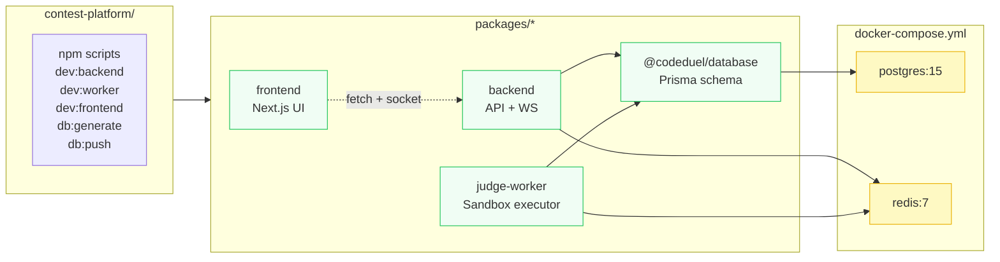

### Package ownership boundaries

| Package | Owns | Does NOT own |
|---|---|---|
| `frontend` | UI, client state, WebSocket subscriptions | Business logic, judging, DB writes |
| `backend` | REST API, auth, queue production, lobby WS events | Code execution, verdict computation |
| `judge-worker` | Sandbox execution, verdict persistence, duel resolution emits | HTTP routing, user-facing auth |
| `@codeduel/database` | Schema, migrations, Prisma client | Application logic |

---

## 3. Frontend Architecture

### Stack

- **Next.js 16** App Router with route groups: `(auth)`, `admin/`, `duels/`, `problems/`, `profile/`
- **React 18** with local component state (no global store)
- **Tailwind CSS 3** with CSS variable theming and dark mode
- **Monaco Editor** for the solve experience
- **Socket.io Client** for real-time verdict and duel events

### Application shell

```
src/app/layout.tsx
├── ThemeProvider
├── AuthProvider          ← JWT + user in localStorage
├── ToastProvider
├── Navbar
├── {children}
└── Footer
```

### Key pages

| Route | Component responsibility |
|---|---|
| `/` | Landing page, feature overview |
| `/login`, `/signup` | Auth forms → `AuthContext.login()` |
| `/problems` | Problem list with tag/difficulty filters |
| `/problems/[slug]` | Monaco editor, submit, live verdict UI, duel mode |
| `/duels` | Create/join duel form |
| `/duels/[code]` | Lobby with WebSocket participant sync |
| `/duels/[code]/summary` | Post-game ELO and code recap |
| `/profile/[username]` | Stats, heatmap, streak, submissions |
| `/admin/problems/*` | Admin CRUD guarded by role |

### State management pattern

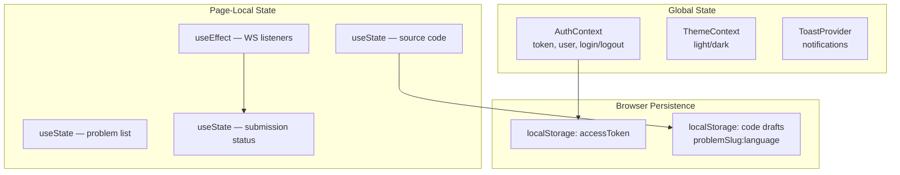

**Design choice:** No Redux/React Query. For the current scale, page-local state + context providers reduce complexity. A centralized API client and React Query cache are recommended before scaling to contest leaderboards.

### API integration

The frontend calls `http://localhost:4000/api/*` directly (hardcoded). Authenticated requests attach:

```
Authorization: Bearer <accessToken>
```

Socket connection (`src/lib/socket.ts`):

```typescript
io(NEXT_PUBLIC_SOCKET_URL || 'http://localhost:4000', {
  autoConnect: false,
  transports: ['websocket'],
});
```

Connections are opened on-demand (solve page, duel lobby) and torn down on unmount.

---

## 4. Backend Architecture

### Entry point

`packages/backend/src/index.ts` bootstraps:

1. Express application with CORS + JSON body parser
2. HTTP server wrapping Express (required for Socket.io)
3. Socket.io with Redis adapter for horizontal scaling
4. Route mounting under `/api/*`
5. Health check at `GET /health`

### Layered structure

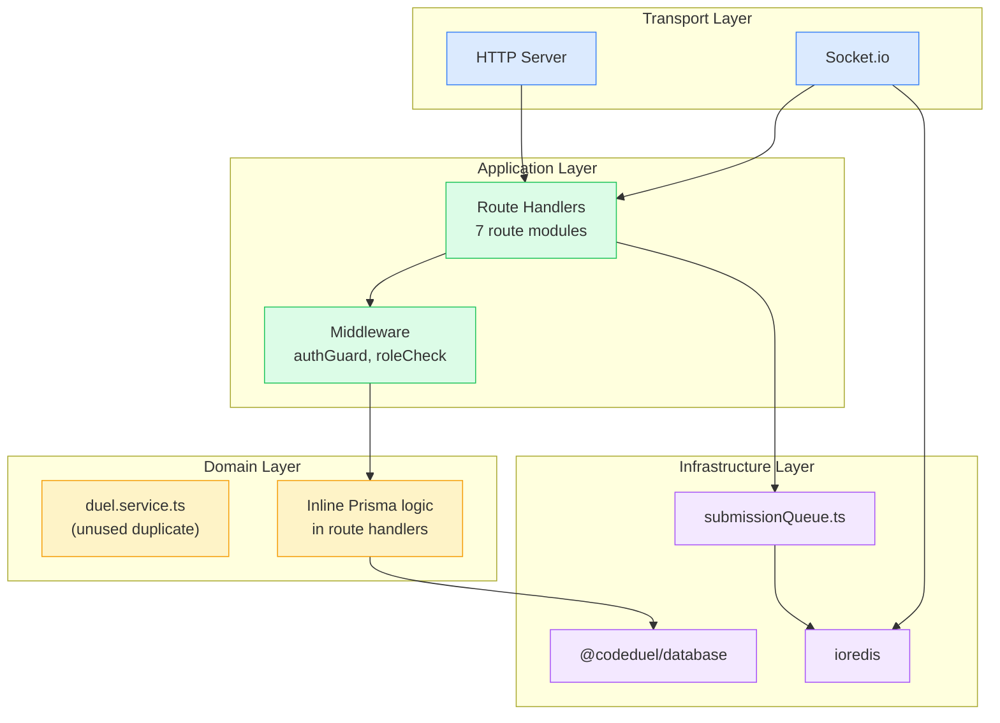

### Middleware

| Middleware | File | Behavior |
|---|---|---|
| `authGuard` | `middleware/authGuard.ts` | Extracts Bearer JWT, verifies with `JWT_SECRET`, attaches `req.user = { id, role }` |
| `roleCheck(role)` | `middleware/authGuard.ts` | Allows access if role matches or user is `admin` |

**Not yet implemented:** rate limiting, request validation library (Zod/Joi), global error handler, structured logging.

---

## 5. API Architecture

### Route modules

| Prefix | Module | Responsibility |
|---|---|---|
| `/api/auth` | `auth.routes.ts` | Signup, login, token issuance |
| `/api/problems` | `problem.routes.ts` | Problem CRUD, search, user solve status |
| `/api/submissions` | `submission.routes.ts` | Submit code, query history |
| `/api/testcases` | `testcase.routes.ts` | Test case CRUD (admin), sample visibility |
| `/api/users` | `user.routes.ts` | Profile, stats, heatmap |
| `/api/duels` | `duel.routes.ts` | Lobby, start, summary |
| `/api/tags` | `tag.routes.ts` | Tag taxonomy |

### Authentication flow

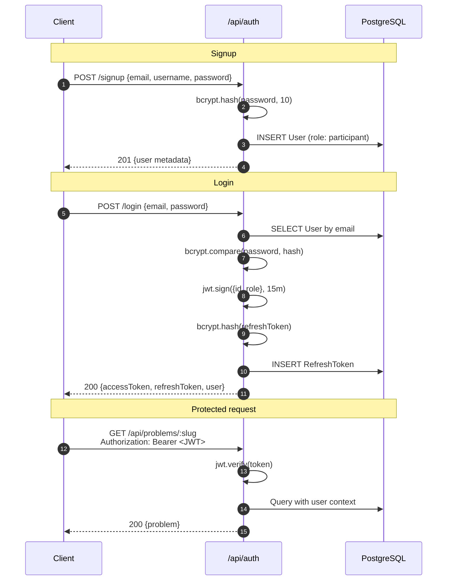

### Authorization matrix

| Resource | Public | Participant | Admin |
|---|---|---|---|
| List problems | ✅ | ✅ (+ solve status) | ✅ |
| View unpublished problem | ❌ | ❌ | ✅ |
| Submit code | ❌ | ✅ | ✅ |
| Create/edit problems | ❌ | ❌ | ✅ |
| Manage test cases | ❌ | ❌ | ✅ |
| Create/join duels | ❌ | ✅ | ✅ |

### Request flow diagram

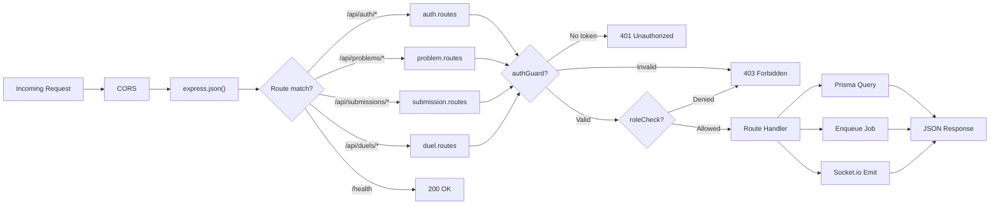

---

## 6. Real-Time Communication

### Architecture

Socket.io runs on the **same HTTP server** as Express. The **Redis adapter** enables multiple API replicas to share room membership. The **judge-worker** uses `@socket.io/redis-emitter` to publish events without maintaining WebSocket connections.

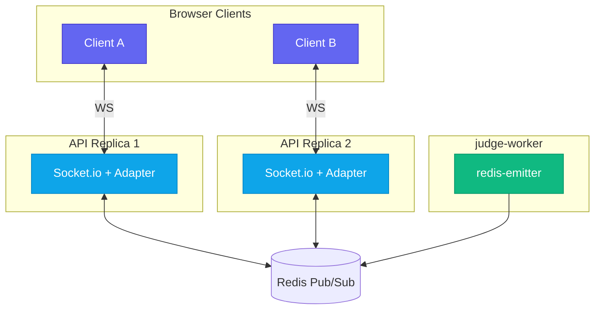

### Room model

| Room name | Join trigger | Events emitted |
|---|---|---|
| `{submissionId}` | `subscribe_submission` | `submission_update`, `test_case_update` |
| `room_{CODE}` | `join_lobby_room` | `lobby_update`, `duel_started`, `opponent_progress`, `duel_finished` |

### WebSocket communication flow

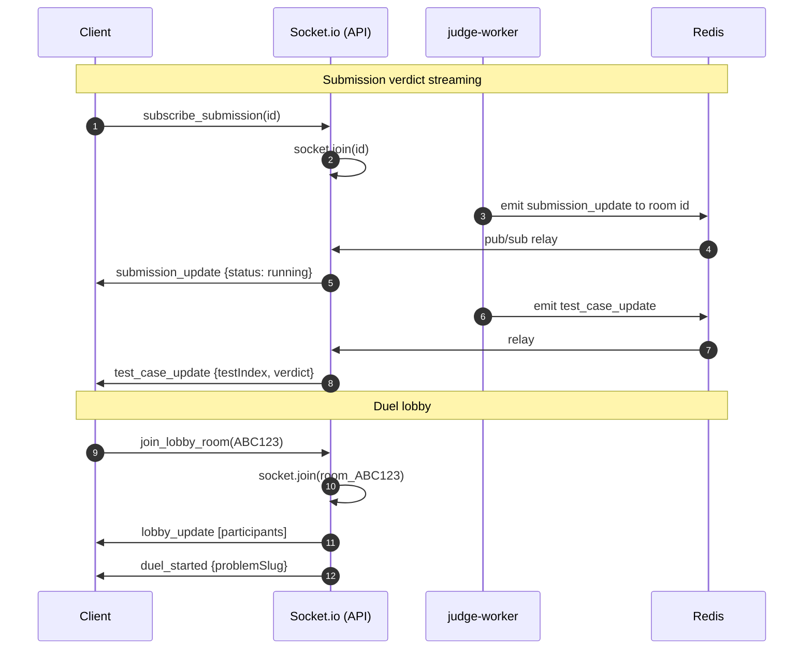

### Real-time event flow (complete)

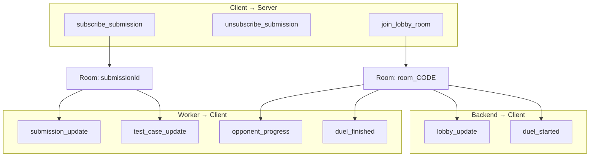

---

## 7. Queue & Worker Architecture

### Producer (backend)

```typescript
// packages/backend/src/queue/submissionQueue.ts
new Queue('submission-queue', {
  defaultJobOptions: {
    attempts: 3,
    backoff: { type: 'exponential', delay: 1000 },
    removeOnComplete: true,
    removeOnFail: 100,
  },
});
```

Job payload:

```json
{
  "submissionId": "uuid",
  "problemId": "uuid",
  "language": "python",
  "sourceCode": "...",
  "duelCode": "ABC123",
  "userId": "uuid"
}
```

### Consumer (judge-worker)

```typescript
// packages/judge-worker/src/index.ts
new Worker('submission-queue', processSubmission, { concurrency: 2 });
```

### Queue processing flow

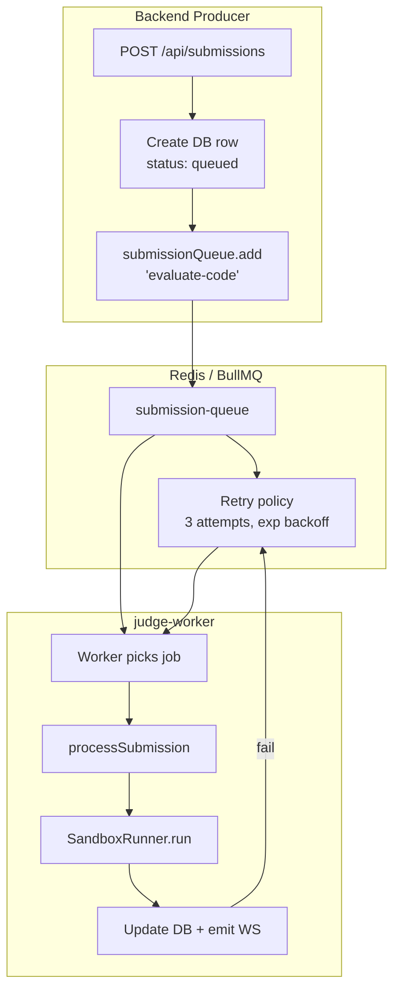

---

## 8. Judge & Execution Pipeline

### SandboxRunner execution model

Each submission creates a **temporary directory** on the worker host. Source code is written to disk, mounted into ephemeral Docker containers via bind mounts.

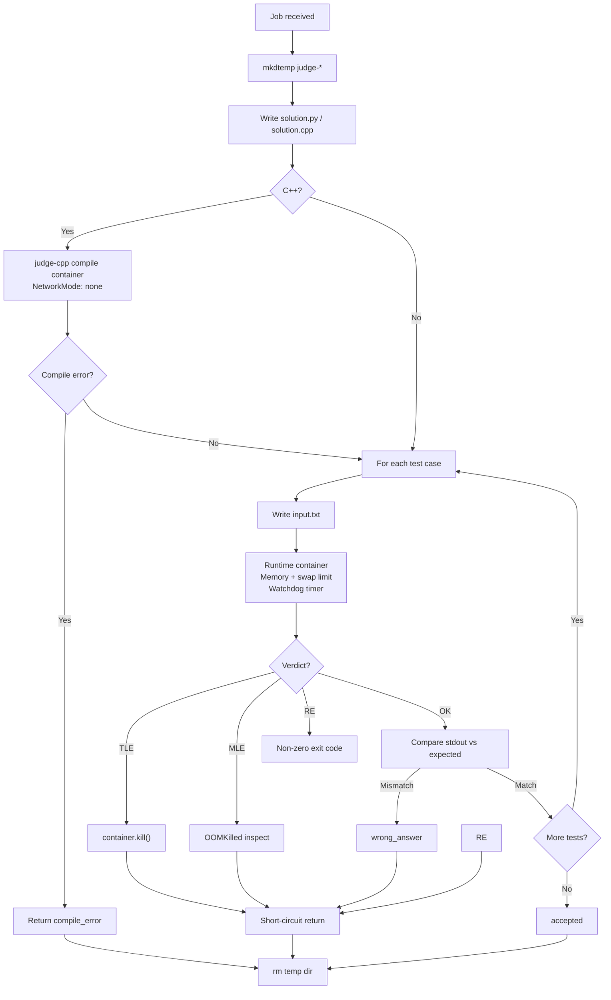

### Security properties of execution

| Property | Implementation |
|---|---|
| Network isolation | `NetworkMode: 'none'` |
| Memory limit | `Memory` + `MemorySwap` = `memoryLimitMb * 1024²` |
| Time limit | `setTimeout` → `container.kill()` |
| Privilege | Non-root `sandboxuser` (UID 1000) in images |
| Filesystem | Bind mount single temp dir; cleaned in `finally` |
| Output truncation | `actualOutput` capped at 1000 chars in DB |

### Supported languages

| Language | Image | Status |
|---|---|---|
| Python | `judge-python` (3.11-alpine) | ✅ Production |
| C++ | `judge-cpp` (GCC 13) | ✅ Production |
| Java, JS, Go, Rust | — | 🗺️ Schema + UI only |

---

## 9. Lifecycle Diagrams

### Practice submission lifecycle

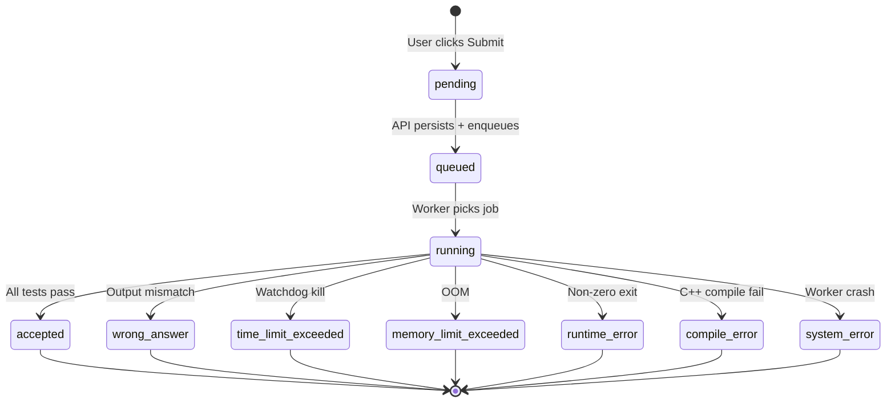

### Submission lifecycle (sequence)

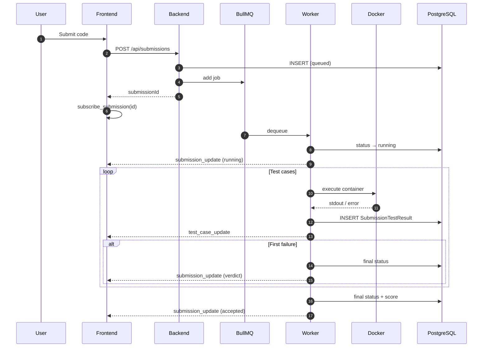

### Duel lifecycle

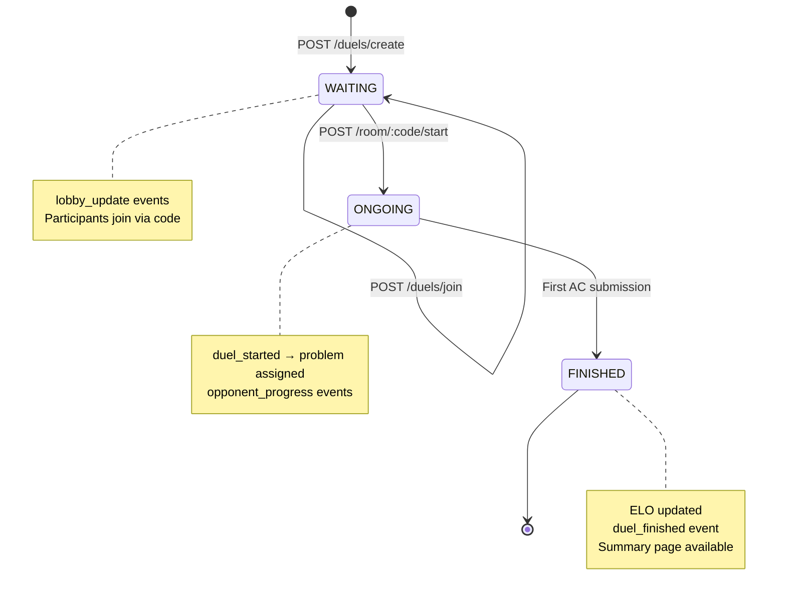

### Duel lifecycle (sequence)

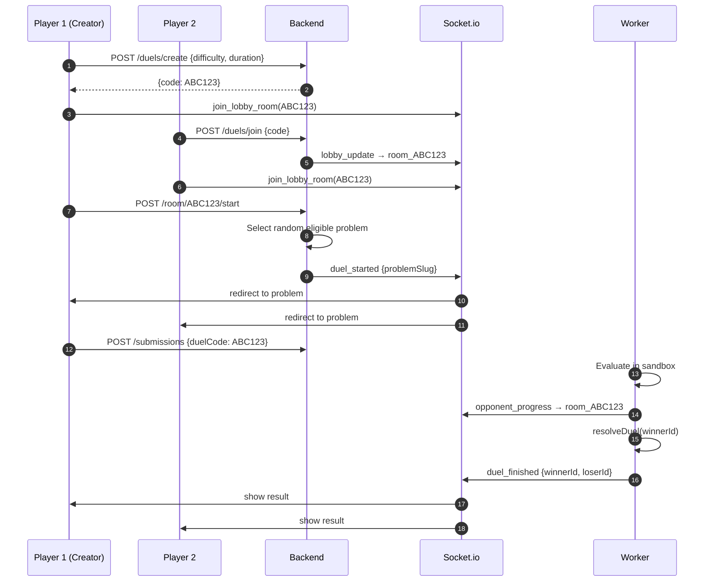

### Contest lifecycle (planned)

> Not yet implemented. Architectural target for the contest module:

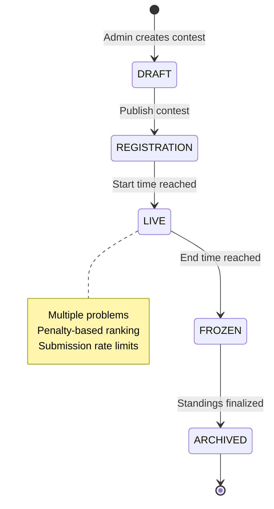

### Judge pipeline (detailed)

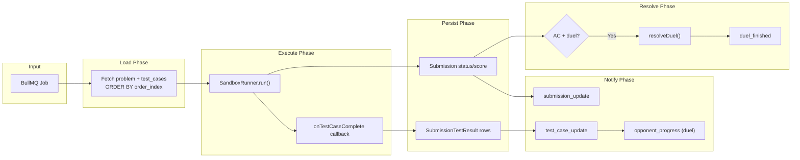

---

## 10. Security Architecture

### Threat model

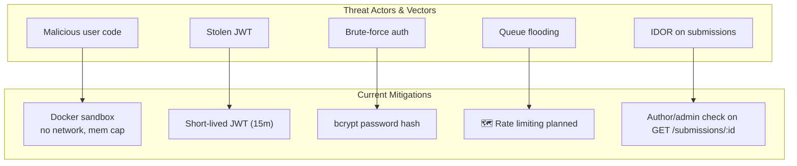

### JWT flow

| Token | Lifetime | Storage | Validation |
|---|---|---|---|
| Access token | 15 minutes | Client localStorage | `authGuard` on each request |
| Refresh token | 7 days | PostgreSQL (hashed) | 🗺️ `/api/auth/refresh` not yet wired |

### Secure code execution checklist

- [x] Separate worker process (never on API server)
- [x] Ephemeral containers per test case
- [x] Network disabled
- [x] Memory + swap capped
- [x] Time limit enforced via watchdog
- [x] Non-root container user
- [x] Temp directory cleanup in `finally`
- [ ] seccomp/AppArmor profiles (roadmap)
- [ ] Read-only root filesystem (roadmap)
- [ ] gVisor/Firecracker runtime (roadmap)

---

## 11. Architectural Decisions & Tradeoffs

### Why BullMQ instead of synchronous judging?

**Problem:** Running user code in the API process blocks the event loop and creates a single point of failure.

**Decision:** Enqueue every submission; dedicated workers consume at controlled concurrency.

**Tradeoff:** Verdicts are eventually consistent (typically sub-second). Requires Redis availability.

**Alternative considered:** Serverless functions (AWS Lambda). Rejected for local dev complexity and cold-start latency on compile-heavy C++.

### Why Docker instead of isolate/nsjail?

**Decision:** Dockerode-managed containers with cgroup limits.

**Tradeoff:** Requires Docker daemon on worker nodes; weaker isolation than microVMs.

**Alternative considered:** Piston API, Judge0 hosted service. Rejected to maintain full control and avoid vendor dependency.

### Why Redis for both queue and Socket.io?

**Decision:** Single Redis cluster serves BullMQ and Socket.io pub/sub.

**Tradeoff:** Redis is a critical dependency; failure affects both async processing and real-time.

**Alternative considered:** Separate Redis instances for queue vs pub/sub. Deferred until scale requires isolation.

### Why Prisma shared package?

**Decision:** `@codeduel/database` exports one Prisma client used by backend and worker.

**Tradeoff:** Schema changes require coordinated deploys of both services.

**Alternative considered:** Generated OpenAPI types for frontend. Frontend currently uses local interfaces; Prisma types could be shared via a `@codeduel/types` package.

---
